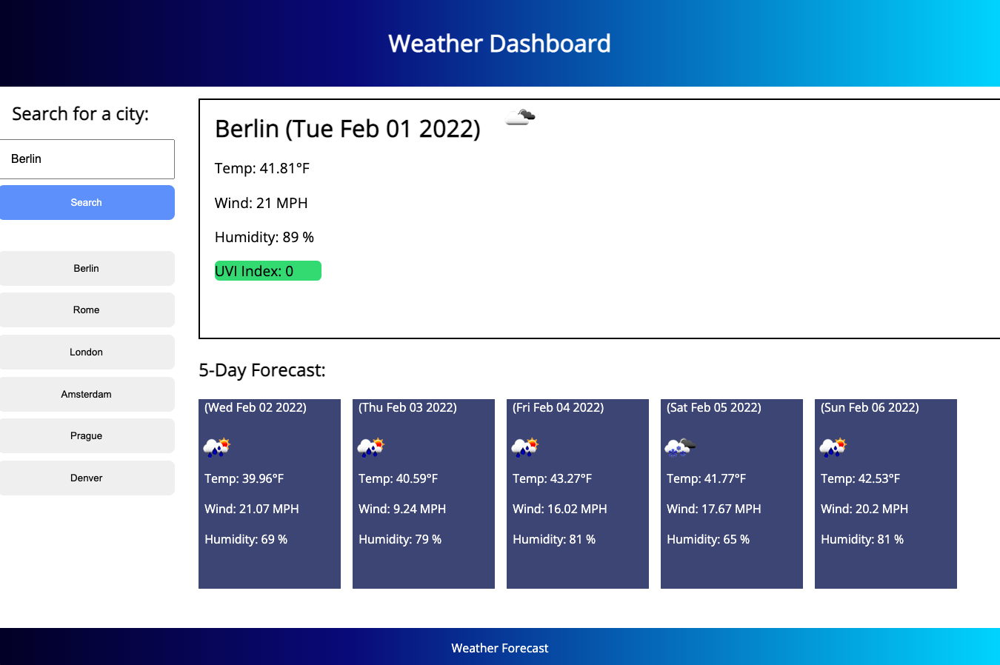

# Du-weather-proj-6

Weather Forecast Application for class project. 

## Goals
- Application retrieves current and five day forecasts
- Application leverages API for weather data
- Dynamic updates to DOM with weather content 
- Localstoarage to save history of search

## Design Choices 
- No bootstrap all self coded 
- Search history updates with the last city on top and removes duplicates 
- JS is done asynchronously where applicable 
- Avoid globals and keep variables tightly scoped for better memory performance 
- Content security policy for better security posture 

### Link and Screen Shot of Application 

[Link](https://anon123123123.github.io/du-weather-proj-6/)

